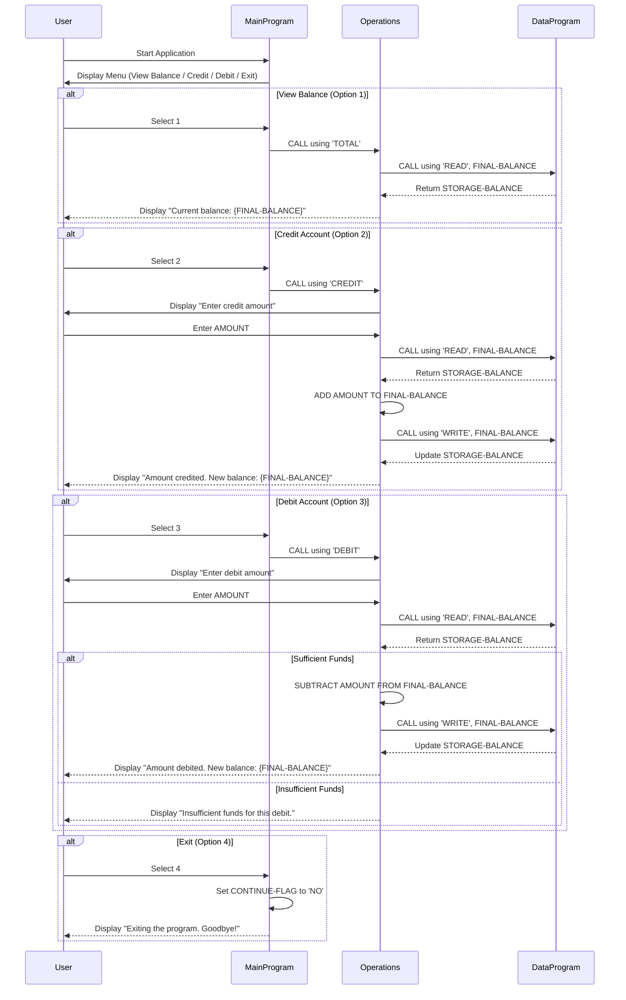

# Mergington High School - Legacy COBOL Accounting System Documentation

## Overview

This documentation describes the legacy COBOL-based accounting system used by Mergington High School since the early 1990s. The system manages student fees, cafeteria accounts, and school supplies purchases.

## COBOL Files

### 1. `main.cob` - Main Program (`MainProgram`)

**Purpose:** Entry point of the application. Provides an interactive menu-driven interface for account management operations.

**Key Functions:**
- Displays the Account Management System menu with 4 options:
  1. View Balance
  2. Credit Account
  3. Debit Account
  4. Exit
- Accepts user input and delegates to the `Operations` program via CALL statements
- Loops until the user selects Exit (option 4)

**Business Rules:**
- Valid user choices are 1 through 4
- Invalid choices display an error message and re-prompt the user
- The program runs continuously until the user explicitly exits

---

### 2. `data.cob` - Data Program (`DataProgram`)

**Purpose:** Handles all data storage and retrieval for student account balances. Acts as the data access layer.

**Key Functions:**
- `READ` operation: Returns the current `STORAGE-BALANCE` value to the caller
- `WRITE` operation: Updates `STORAGE-BALANCE` with a new balance value

**Business Rules:**
- Initial balance is set to `1000.00` (default starting balance for student accounts)
- Supports only two operations: READ and WRITE, passed via `PASSED-OPERATION` parameter
- Balance is stored as a packed decimal with 2 decimal places (`PIC 9(6)V99`)

---

### 3. `operations.cob` - Operations Program (`Operations`)

**Purpose:** Contains the business logic for all account operations. Processes credits, debits, and balance inquiries by interacting with `DataProgram`.

**Key Functions:**
- `TOTAL` operation: Reads the current balance from `DataProgram` and displays it
- `CREDIT` operation: Prompts for an amount, reads current balance, adds the amount, writes the updated balance, and confirms the transaction
- `DEBIT` operation: Prompts for an amount, reads current balance, checks for sufficient funds, subtracts the amount, writes the updated balance, and confirms the transaction

**Business Rules:**
- **Insufficient Funds**: If the account balance is less than the requested debit amount, the transaction is rejected with the message "Insufficient funds for this debit."
- **Credit**: Any positive amount can be added to the account
- **Balance Display**: Balance is shown with 2 decimal place precision
- Initial balance defaults to `1000.00`

---

## Data Flow Sequence Diagram

